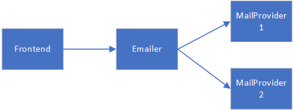
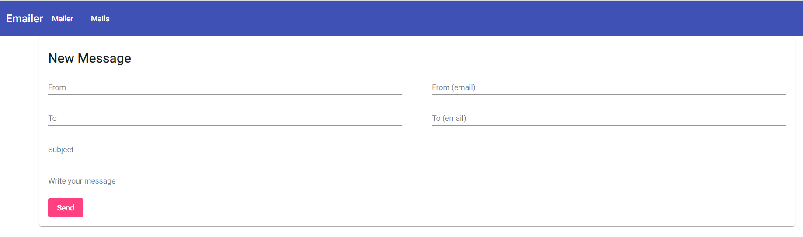
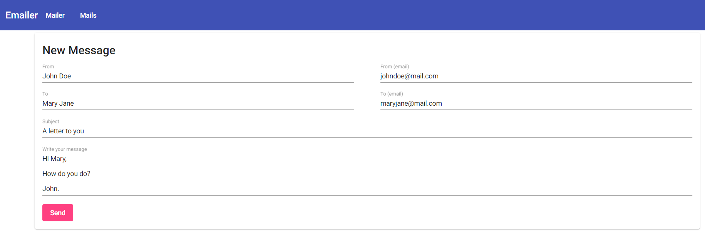
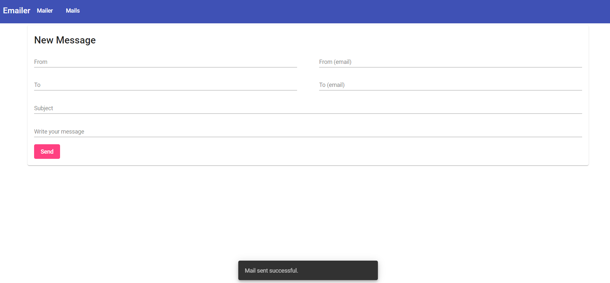
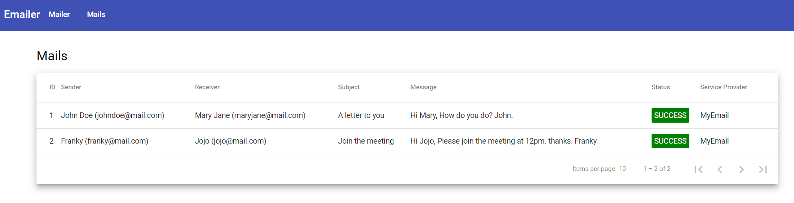

# Emailer

This is an application in which a user can send an email to a recipient. This application is allowed to configure a list of email service providers which will be applied in round robin strategy based on the priority. This application is developed with a frontend web with Angular & Angular Material and two backend API services with Spring Boot framework. Two backend API services are MailService which is the core function to serve email service and MailProvider which is a mock email provider in testing.



In emailer directory, there are subdirectories:

- `emailer/mail-service`
- `emailer/mail-provider`
- `frontend`

The following is the list of tools to build the application:

- `Java 8`
- `Maven 3.6.1`
- `Docker (optional)`
- `Node.js v16.14.2`
- `npm 8.5.0`
- `@angular/cli 13.3.3`


## How to run

- In order to easy run the service, I would suggest to launch each service manuallu

### Build and launch Emailer Frontend

- navigate to `emailer/frontend`, and and run the following command will serve at `http://localhost:4200` 

```sh
# to install dependencies
$ npm install
# to serve to frontend page
$ ng serve
```


## Build and launch Emailer & Mail Provider

- navigate to `emailer/emailer`

```sh
mvn clean package
```

- launch Emailer, navigate to `emailer/emailer/mail-provider`, and run the following command will serve at `http://localhost:9000` 

```sh
java -jar target/mail-service-1.0-SNAPSHOT.jar
```

- launch mail provider 1, navigate to `emailer/emailer/mail-service`, and run the following command will serve at `http://localhost:9001` 

```sh
java -jar target/mail-provider-1.0-SNAPSHOT.jar
```

- launch Mail Provider 2, navigate to `emailer/emailer/mail-service`, and run the following command will serve at `http://localhost:9002` 

```sh
java -Dapi-key=sdibviuw983 -Dserver.port=9002 -jar target/mail-provider-1.0-SNAPSHOT.jar
```


## Libraries Used and Why

- I choose Spring Boot framework in this project to develop backend service beside the familiarity of this framework, it also provides a lot of sensible defaults configurations to scaffold the application. By using Angular in this project as it provides me a lot of built-in features like HttpClient and its organized structure is very easy to navigate to each component and seamlessly integrated with Angular Material UI component library to build web application faster.


## A screenshot/gif of what was made

- Emailer launch with a New Message page



- fill in the form to send an email



- sent successful with notification



- navigate to Mails page to see list of processed mails




## What you would do if you had more time

- The drawback of this design is using HTTP communication with Mail Service providers in round-robin strategy which could cause a lot of turnaround time to process the email sending if one of Mail Service provider is unreachable. In order to increase the throughput of emails transportation, message queue is introduced to handle the request asynchronously.
- To complete form validations in frontend and request validation in backend service.
- To improve UI/UX so that users will use it intuitively.
- Current application only can support one recipient, can enhance to list of recipients in the future.
- To build a function that can map the corresponding properties dynamically that Mail Service provider required in specifications.
- To build a mail resend function in the mail list dashboard if it was failed in mail sending.


# Additional (Optional)

- This section is to build the project in docker way. 


## Build with Script (with Docker build)

- In the emailer directory, there are two scripts to build project and docker images together
  - `build.sh` for Linux
  - `build.bat` for Windows


## Manual Build

### Backend

- change to the emailer backend folder

```sh
$ cd emailer/emailer
```

- requires Maven installed with version 3.6.1 or greater to build the emailer application

```sh
$ mvn clean package
```

- launch emailer service

```sh
$ java -jar mail-service/mail-service-1.0-SNAPSHOT.jar
```

- launch mail provider with configurable API key

```java
$ java -Dapi-key=<xxxx> -jar mail-provider/mail-provider-1.0-SNAPSHOT.jar
```


### Frontend

- change to the emailer frontend folder

```sh
# navigate to frontend directory
$ cd emailer/frontend
# install libraries
$ npm install
```

- if you are going to run Angular app in Docker, it is required to change the following environment variable to point to the correct mail service

```json
export const environment = {
  production: false,
  mailService: 'http://<host>:9000/api/v1/mails'
};
```

- build Angular

```sh
$ ng build
```

- copy files in `dist/frontend` to `/usr/share/nginx/html` and launch Nginx
- serve Angular if do have Nginx

```sh
$ ng serve
```

- navigate to `http://localhost:4200` in the browser


### Docker Build

- if you want to run applications on Docker, it is required to change the mail provider URL in the database.

- navigate to `http://<host>:9000/h2-console` dashboard with in-memory database `jdbc:h2:mem:testdb`.
- you can change the URL of email provider as follows where host is the machine hosting the email provider service.

```sql
UPDATE EMAIL_PROVIDER
SET URL = 'http://<host>:9001/api/v1/provider-service'
```

- this section is the steps to build docker images
- to build mail-service

```sh
# change to mail-service directory
$ cd mail-service
# build docker image with Dockerfile
$ docker build -t mail-service .
```

- to build mail-provider

```sh
# change to mail-provider directory
$ cd mail-provider
# build docker image with Dockerfile
$ docker build -t mail-provider .
```

- to build frontend

```sh
# change to frontend directory
$ cd frontend
# build docker image with Dockerfile
$ docker build -t mail-frontend .
```

